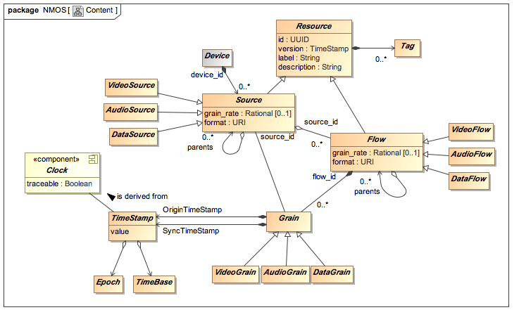

# AMWA NMOS Realtime Event Grain Specification
(c) AMWA 2017

NMOS Specifications shall be consistent with the logical content model represented by the following UML class diagram, and defined in this document.

The elements of this model are abstract, and other NMOS Specifications define how these map into interfaces, for example to convey in-stream identity and timing information in an RTP stream.

This specification also adheres to the [proposed NMOS content model](https://github.com/AMWA-TV/nmos-content-model).

## Required

- **source_id**: Unique identifier of the Source that produced the Grain.
- **flow_id**: Unique identifier of the Flow that contains the Grain.
- **origin_timestamp**: A TimeStamp representing the capture time of the Grain Payload. For Grain Payloads with multiple samples, this shall be the sample time of the first sample. When capturing from a live source this should match the SyncTimeStamp. When replaying stored essence this should be populated from the Origin Timestamp of the stored Grain.
- **sync_timestamp**: a TimeStamp representing the capture or playback time of the Grain Payload. For Grain Payloads with multiple samples, this shall be the sample time of the first sample.
- **grain_type**: defines the grain type - set to "event".

## Optional

- **control_id**: Unique identifier of the Control that produced the Grain.
- **sync_id**: Unique identifier.
- **device_id**: Unique identifier of the Device that produced the Grain.

- **description**: String.
- **label**: String. 
- **mnemonic**: String.
- **type**: String. Typical usage is to denote the event type.
- **value**: String.

- **creation_timestamp**: A TimeStamp representing the creation time of the Grain.

- **time_offset**: Integer representing a time offset in milliseconds
- **state**: Integer representing a state.
- **position**: Integer.
- **minimium**: Integer.
- **maximium**: Integer.
- **step_size**: Integer.
- **default_position**: Integer.

- **status_map**: An array of statuses, each consisting of a name (string) and a description (string)

## Extended

If required, additional data can be added to the Extended packet.

